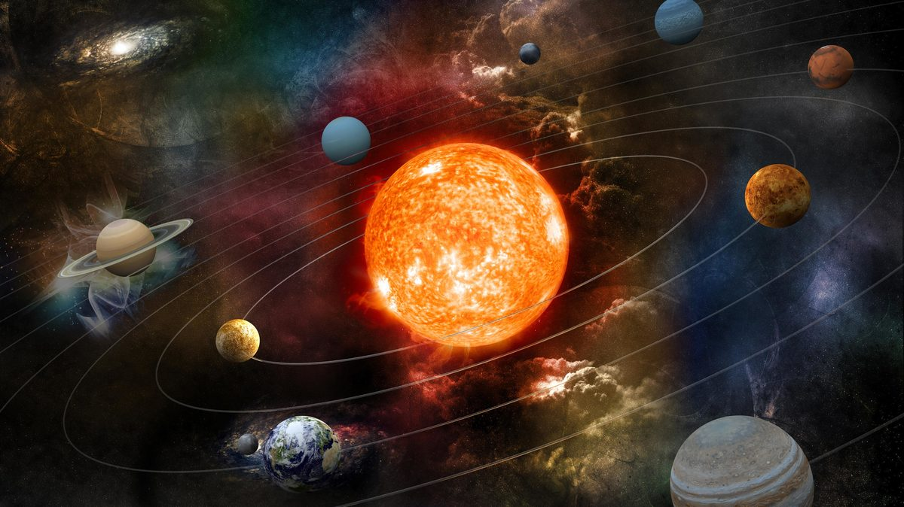

# Game-Engines-1_assignment
Paint a picture in code
Name:Dongjie Yang 

Student Number:D18125749  

Class Group:DT508

Description:You must have looked up at the stars at night. Have you ever thought about the stars and the universe? When you travel in space, you will meet celestial bodies with various trajectories, such as planets revolving around stars and uncertain comets.This sense will show part of the universe as much as possible, will use trigonometric functions and AI to simulate the trajectory of celestial bodies and planets, and will also combine with background music to show a scientific and technological electronic feeling.

Proud of in the assignment:Restore as much as possible and combine the elements of the universe and electronic music to create a novel style.

Reference:
  
https://www2.kek.jp/ilc/ja/clarification/

  
https://president.jp/articles/-/46378?page=1

Orbits:

https://solarsystem.nasa.gov/basics/chapter4-1/

https://courses.lumenlearning.com/astronomy/chapter/orbits-in-the-solar-system/
